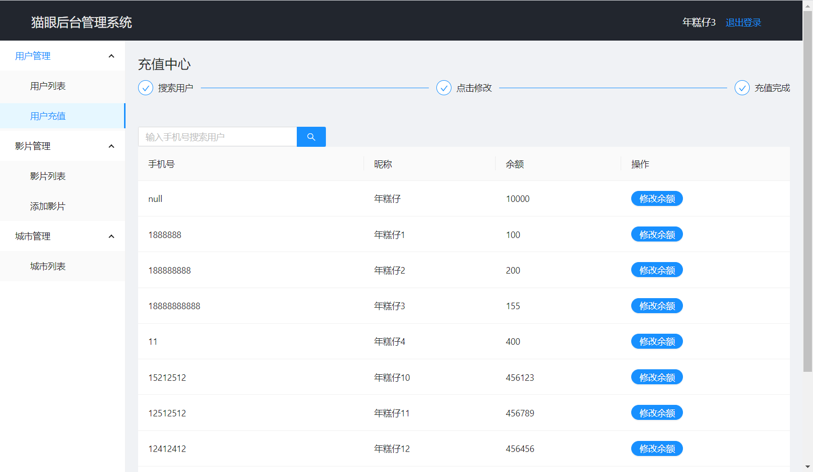

### 项目名称 猫眼（一个电影购票app）

### 项目演示
* 上线地址
    * app： http://159.75.52.223:8080
    * 后台管理系统： http://159.75.52.223:8081

* git仓库地址： https://github.com/gzh52101/Maoyan

* 数据库说明：创建一个名字为lenmon的库导入即可

* 团队架构：
    * 组长：陈明聪
    * 团队成员：刘炜明，梁伟锋

* 分工：
    * 陈明聪：负责api，协助开发app与后台管理系统的其中一些模块
    * 梁伟锋：负责app
    * 刘炜明：负责后台管理系统

* 项目截图

